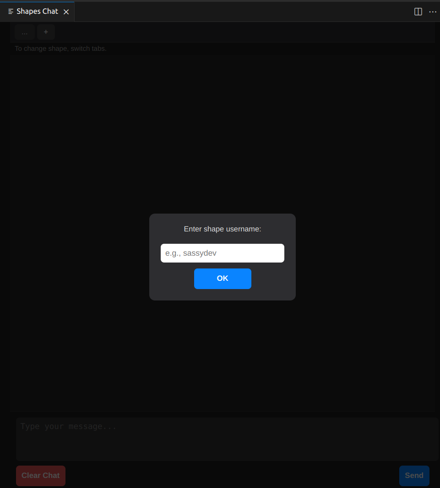
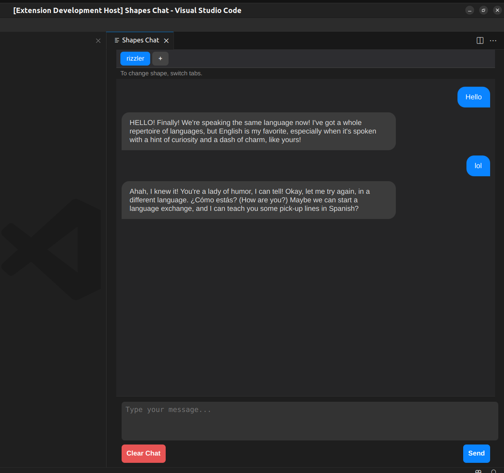

# Shapes Chat — VS Code Extension

Chat with [Shapes AI](https://shapes.inc) agents directly from Visual Studio Code. This extension allows developers to interact with multiple Shapes-based models simultaneously in a clean, tabbed interface.

---

## 📌 Overview

**Shapes Chat** is a VS Code extension that integrates with the Shapes API, enabling direct communication with AI agents from the editor. Each conversation is managed per-agent via tabbed sessions, with full message history retained per shape.

---

## ✨ Features

- ✅ Chat with any Shapes model using its shape username
- ✅ Create multiple tabs — one per shape agent
- ✅ Isolated chat history per shape tab
- ✅ Clean, dark-themed UI with assistant/user message styling
- ✅ Clear individual chat histories
- ✅ Built with native VS Code Webview API

---

## ⚙️ Prerequisites

Before you begin, make sure you have:

- **Node.js v14+** installed (16 recommended)
- **Visual Studio Code v1.70.0+**
- A valid **Shapes API key** (`SHAPESINC_API_KEY`) from [https://shapes.inc](https://shapes.inc)

> ℹ️ If your VS Code version is older than 1.88, the extension uses the `node-fetch` polyfill for API calls.

---

## 🗂 Directory Structure       
shape-vscode/          
├── extension.js     
├── package.json      
├── .env      
├── .gitignore  
├── .vscodeignore  
└── README.md  
├── media


## 🛠 Installation

1. **Clone & install dependencies**

   ```bash
   git clone [repo-url]
   cd shape-vscode
   npm install
   ```

   ### IMPORTANT   
   When developing a VS Code extension, you must open the folder containing the package.json directly as the workspace root in VS Code.
   Hence make sure that the folder **shape-vscode** is opened as the workspace root in VS Code

2. **Add your Shapes API key in the .env file**
   
    SHAPESINC_API_KEY= /<your-api-key/>      
    Get yours from https://shapes.inc/developer

3. **Launch Extension Development Host**

    Open extension.js and press F5, select VS Code Extension Development

4. **Open the Shapes Chat window**

    Press Ctrl + Shift + P, (or ⇧⌘P on macOS) to open the Command Palette.  
    Search for and run: Shapes Chat: Open Chat

5. **Using Shapes Chat**

    - Click on + to create a new chat and enter the shape username (Note that currently you can talk to a shape in one chat only)

    

    - After entering your preferred shape, you can start chatting!

    

    - Click on 'Clear Chat' to clear the chat and on '+' to chat with more shapes


## Deployment

I haven't published it yet as a VS code extension, I am working on it.

## Licenses

Sorry I have no idea about this part.

## Acknowledgements

[Shapes.inc](https://shapes.inc/)
